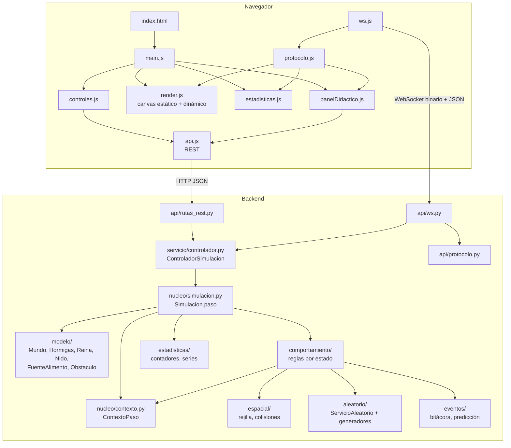
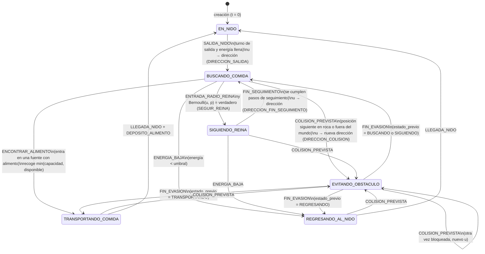
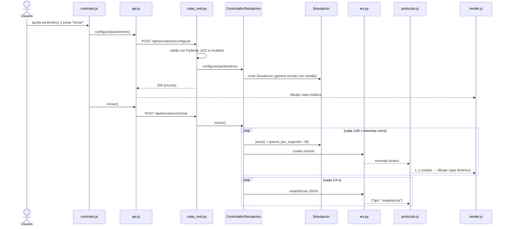
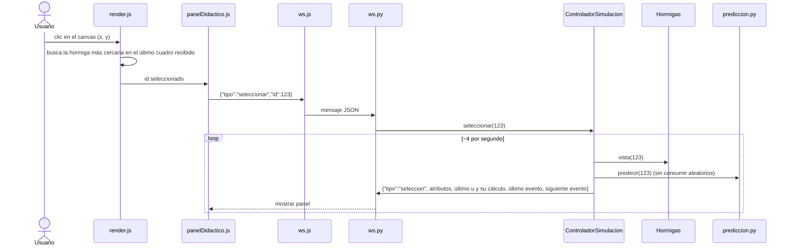

# DISENO.md — Simulador educativo de hormiguero

> Etapa 0: análisis y diseño. **Estado: decisiones resueltas, pendiente de aprobación final.**
> Fuente de requerimientos: `docs/ESPECIFICACION_v2.md` (versión refinada de
> `docs/ESPECIFICACION.md`, que se conserva como original del cliente). Reglas permanentes: `CLAUDE.md`.
> El desarrollo se organiza en **4 etapas** (E1–E4, sección 14).
> Los valores por defecto que aparecen aquí son propuestas; la fuente de verdad será
> `backend/app/config.py` (con descripción, unidad y rango de cada parámetro).
> Lo marcado con **[DA-x]** depende de una decisión abierta (sección final).

---

## 1. Arquitectura general

El sistema se divide en tres capas con dependencias en un solo sentido
(frontend → api → servicio → núcleo):

| Capa | Carpeta | Responsabilidad | Sabe de la web |
|---|---|---|---|
| Presentación | `frontend/` | Dibujar en canvas, mostrar estadísticas y el panel didáctico, enviar comandos. No calcula nada del modelo. | Sí |
| API | `backend/app/api/` | Rutas REST, WebSocket y serialización binaria (`protocolo.py`). Valida parámetros con Pydantic. | Sí |
| Servicio | `backend/app/servicio/` | `ControladorSimulacion`: bucle asyncio, pausa, velocidad, desacople entre pasos simulados y cuadros enviados. | Sólo asyncio |
| Núcleo | `nucleo/`, `modelo/`, `comportamiento/`, `espacial/`, `aleatorio/`, `eventos/`, `estadisticas/` | El modelo de simulación: estado, reglas, generadores, eventos, contadores. Python puro + NumPy. | **No** |

**Por qué el núcleo no depende de FastAPI:**

1. **Didáctico**: en clase se puede ejecutar `Simulacion(parametros).paso()` desde un script o
   una consola de Python y mostrar que "la simulación" es el modelo, no la página web.
2. **Pruebas**: las pruebas de determinismo, conservación y colisiones corren sin servidor,
   en milisegundos.
3. **Experimentación (etapa E4)**: las réplicas por lote ejecutan el mismo núcleo miles de pasos
   sin red ni render, a máxima velocidad.
4. **Única fuente de verdad**: el servidor tiene el estado; el navegador sólo recibe una
   proyección (posiciones y estados) para dibujar.

**Modelo de avance del tiempo**: tiempo discreto con paso fijo `dt` y **bitácora de eventos**.
En cada paso se avanzan todas las hormigas; los eventos (salir del nido, colisión, encontrar
alimento…) se detectan *dentro* del paso y se registran con tiempo, hormiga, tipo y número
pseudoaleatorio usado. No es un simulador de eventos discretos puro (no hay lista de eventos
futuros que haga saltar el reloj); el "siguiente evento" del modo didáctico es una
**predicción** calculada sólo para la hormiga seleccionada.

---

## 2. Diagrama de componentes



Versión ASCII:

```
┌────────────────────────────── Navegador ──────────────────────────────┐
│ index.html → main.js                                                   │
│   ├─ controles.js ──┐                    ┌─ render.js (2 canvas)        │
│   ├─ panelDidactico ┼─ api.js (REST)     ├─ estadisticas.js             │
│   └─ ws.js ─────────┼────────────────────┴─ protocolo.js (decodifica)   │
└─────────────────────┼──────────────────────────▲────────────────────────┘
          HTTP JSON   │                          │  WebSocket (binario + JSON)
┌─────────────────────▼──────────── Backend ─────┴────────────────────────┐
│ api/rutas_rest.py      api/ws.py ── api/protocolo.py                     │
│        └───────────┬───────┘                                            │
│        servicio/controlador.py  (bucle asyncio, pausa, velocidad)        │
│                    │                                                    │
│        nucleo/simulacion.py  Simulacion.paso()  ── nucleo/contexto.py    │
│          ├─ modelo/          Mundo, Hormigas (SoA), Reina, Nido, ...     │
│          ├─ comportamiento/  una regla por estado + transiciones         │
│          ├─ espacial/        rejilla de obstáculos y alimento            │
│          ├─ aleatorio/       ServicioAleatorio → GeneradorCuadradosMedios│
│          ├─ eventos/         TipoEvento, Bitacora, prediccion            │
│          └─ estadisticas/    contadores, series, exportar                │
└──────────────────────────────────────────────────────────────────────────┘
```

---

## 3. Modelo conceptual

**Sistema**: el hormiguero (`Simulacion` / `Mundo`).
**Frontera**: rectángulo `[0, Mundo.ancho) × [0, Mundo.alto)`. Lo que está fuera no existe
para el modelo. Tocar la frontera es un evento **[DA-f]**.

**Entradas (parámetros, `ParametrosSimulacion`)**:

| Parámetro | Nombre en código | Unidad | Rango propuesto | Defecto |
|---|---|---|---|---|
| Número de hormigas | `num_hormigas` | entidades | 1 – 20 000 | 2 000 |
| Semilla | `semilla` | entero de `D` dígitos | 1 – 10^D − 1 | 5735 |
| Generador | `generador` | nombre | `cuadrados_medios` (luego más) | `cuadrados_medios` |
| Dígitos del generador | `digitos` | dígitos (par) | 2 – 10 | 4 |
| Velocidad de simulación | `pasos_por_segundo` | pasos/s reales | 1 – 1 000 | 30 |
| Número de rocas | `num_obstaculos` | rocas | 0 – 60 | 12 |
| Número de fuentes | `num_fuentes` **[DA-g]** | fuentes | 1 – 20 | 4 |
| Alimento por fuente | `alimento_por_fuente` **[DA-g]** | unidades | 1 – 100 000 | 2 000 |
| Radio de la reina | `radio_reina` | unidades de longitud | 0 – 300 | 80 |
| Probabilidad de seguir | `p_seguir_reina` | probabilidad | 0 – 1 | 0.3 |
| Paso de tiempo | `dt` | s simulados | fijo 0.1 | 0.1 |
| Velocidad de hormiga | `velocidad_hormiga` | unidades/s | 5 – 40 | 20 |
| Capacidad de carga | `capacidad_carga` | unidades de alimento | 1 – 255 | 5 |
| Tasa de salida | `salidas_por_paso` **[DA-i]** | hormigas/paso | 1 – 100 | 5 |

Mundo por defecto: `ancho = 1000`, `alto = 700` (1 unidad = 1 px a escala 1:1).

**Salidas (estadísticas, `Estadisticas`)**: total de hormigas, conteo por estado
(buscando, regresando, siguiendo a la reina…), alimento recolectado (en el nido), número de
colisiones, cambios de dirección, tiempo de simulación, números pseudoaleatorios generados,
degeneraciones del generador; series temporales de esos valores para gráficas y CSV.

**Diagrama de estados de la hormiga obrera** (`EstadoHormiga`):



Notas:
- `EVITANDO_OBSTACULO` dura `pasos_evasion` pasos (defecto 5) moviéndose en la nueva
  dirección; al terminar vuelve a `estado_previo`. Si una hormiga que regresaba al nido
  evitaba una roca, al volver recupera el rumbo hacia el nido (no consume `u`).
- Después de `FIN_EVASION` una hormiga que estaba `SIGUIENDO_REINA` vuelve a
  `BUSCANDO_COMIDA` (pierde a la reina) para no encadenar estados.
- La tabla de transiciones permitidas vivirá en `modelo/estados.py` y una prueba verificará
  que cada cambio de estado del motor está en esa tabla.

---

## 4. Entidades

| Entidad | Nombre en código | Temporal / permanente | Móvil / fija | Notas |
|---|---|---|---|---|
| Hormiga obrera | `Hormigas` (colección SoA), fila `id` | **Temporal**: entra al sistema (sale del nido) y sale de él (regresa) en ciclos; en `EN_NIDO` no interactúa con el entorno | Móvil | Miles; se modelan como columnas NumPy, no como objetos |
| Reina | `Reina` | **Permanente** | Móvil lenta **[DA-h]** | Una sola; tiene radio de influencia |

Elementos del sistema que **no** son entidades activas:

| Elemento | Nombre en código | Concepto | Móvil / fija |
|---|---|---|---|
| Nido | `Nido` | Parte del sistema / punto de servicio (depósito y recuperación) | Fijo |
| Fuente de alimento | `FuenteAlimento` | Recurso consumible y finito | Fija |
| Roca | `Obstaculo` | Restricción | Fija |
| Espacio | `Mundo` | Entorno y frontera | — |
| Feromonas (etapa E4) | `CampoFeromonas` en `Mundo.campos` | Variable de estado del entorno | — |

---

## 5. Atributos

### Hormigas (estructura de arreglos, longitud `n`)

| Atributo | Columna | Tipo NumPy | Unidad | Rango | Valor inicial |
|---|---|---|---|---|---|
| Identificador | `id` | `int32` | — | 0 … n−1 (igual al índice) | índice |
| Posición X | `x` | `float32` | unidades | [0, ancho) | `nido.x` |
| Posición Y | `y` | `float32` | unidades | [0, alto) | `nido.y` |
| Dirección | `dir` | `float32` | grados | [0, 360) | 0 (se asigna al salir) |
| Velocidad | `vel` | `float32` | unidades/s | parámetro | `velocidad_hormiga` |
| Energía | `energia` | `float32` | unidades de energía | [0, `energia_max`] | `energia_max` **[DA-e]** |
| Estado | `estado` | `uint8` | código `EstadoHormiga` | 0 … 5 | `EN_NIDO` |
| Carga | `carga` | `uint8` | unidades de alimento (enteras) | [0, `capacidad_carga`] | 0 |
| Estado previo | `estado_previo` | `uint8` | código | 0 … 5 | `EN_NIDO` |
| Pasos restantes | `pasos_restantes` | `int16` | pasos | ≥ 0 | 0 |
| Dentro del radio de la reina | `en_radio_reina` | `bool_` | — | — | `False` |
| Último número usado | `ultimo_u` | `float32` | — | [0, 1) | NaN |
| Índice del último número | `ultimo_indice_u` | `int32` | posición en el registro | ≥ −1 | −1 |
| Último evento | `ultimo_evento` | `uint8` | código `TipoEvento` | — | `NINGUNO` |
| Tick del último evento | `tick_ultimo_evento` | `uint32` | pasos | ≥ 0 | 0 |

Decisión de diseño: la **carga y el alimento son enteros** para que la prueba de conservación
(`fuentes + transportado + nido = inicial`) sea exacta, sin errores de redondeo flotante.

Las cinco últimas columnas existen para el modo didáctico y para la máquina de estados;
no se envían al navegador en cada cuadro.

### Reina

| Atributo | Nombre | Tipo | Unidad | Valor inicial |
|---|---|---|---|---|
| Posición | `x`, `y` | `float` | unidades | junto al nido |
| Dirección | `dir` | `float` | grados | 0 |
| Velocidad | `vel` | `float` | unidades/s | `velocidad_reina` (defecto 5) |
| Estado | `estado` | `EstadoReina` (`EN_NIDO`, `PATRULLANDO`) | — | `PATRULLANDO` |
| Radio de influencia | `radio_influencia` | `float` | unidades | `radio_reina` |
| Radio de patrulla | `radio_patrulla` | `float` | unidades | 150 (zona alrededor del nido) **[DA-h]** |

### Nido

| Atributo | Nombre | Tipo | Valor inicial |
|---|---|---|---|
| Posición | `x`, `y` | `float` | centro del mundo |
| Radio | `radio` | `float` | 25 |
| Alimento almacenado | `alimento_almacenado` | `int64` | 0 |

### FuenteAlimento (pocas; arreglos cortos)

| Atributo | Nombre | Tipo | Valor inicial |
|---|---|---|---|
| Identificador | `id` | `int16` | 0 … k−1 |
| Posición | `x`, `y` | `float32` | generada con semilla (propósito `MUNDO`) |
| Radio | `radio` | `float32` | 15 – 30 |
| Cantidad inicial | `cantidad_inicial` | `int32` | `alimento_por_fuente` |
| Cantidad actual | `cantidad` | `int32` | `alimento_por_fuente` |

### Obstaculo (rocas circulares)

| Atributo | Nombre | Tipo | Valor inicial |
|---|---|---|---|
| Identificador | `id` | `int16` | 0 … m−1 |
| Centro | `x`, `y` | `float32` | generado con semilla (`MUNDO`) |
| Radio | `radio` | `float32` | 12 – 45, siempre > `vel·dt` (evita atravesar rocas) |

### Mundo

`ancho`, `alto` (float), `nido`, `reina`, `fuentes`, `obstaculos`, `hormigas`,
`rejilla` (mapas espaciales) y `campos: dict[str, CampoEntorno]` (vacío hasta la etapa E4).

---

## 6. Variables de estado

| Variable | Dónde | Cambia por paso | Cambia por evento |
|---|---|---|---|
| `x`, `y` de cada hormiga | `Hormigas` | ✔ (movimiento) | ✔ (al salir se coloca en el borde del nido) |
| `dir` | `Hormigas` | — (rumbo constante) | ✔ salida, colisión, fin de seguimiento, recoger alimento, rumbo al nido |
| `energia` | `Hormigas` | ✔ (consumo / recuperación) **[DA-e]** | — |
| `estado`, `estado_previo` | `Hormigas` | — | ✔ (sólo por eventos) |
| `carga` | `Hormigas` | — | ✔ recoger / depositar |
| `pasos_restantes` | `Hormigas` | ✔ (cuenta regresiva) | ✔ (se fija al iniciar evasión o seguimiento) |
| `en_radio_reina` | `Hormigas` | ✔ (se recalcula) | — |
| Posición y dirección de la reina | `Reina` | ✔ | ✔ cambio de rumbo **[DA-h]** |
| `cantidad` de cada fuente | `FuenteAlimento` | — | ✔ recoger |
| `alimento_almacenado` | `Nido` | — | ✔ depositar |
| Reloj `tick`, `t = tick·dt` | `Simulacion` | ✔ | — |
| Estado interno del generador | `GeneradorPseudoaleatorio` | — | ✔ cada número pedido |
| Contadores (colisiones, cambios de dirección, números generados, alimento recolectado, degeneraciones) | `Estadisticas` | — | ✔ |
| Conteo por estado | `Estadisticas` | ✔ (se calcula con `bincount` al final del paso) | — |

Regla útil para la clase: **lo continuo cambia por paso, lo discreto cambia por evento**.

---

## 7. Eventos (`TipoEvento`)

| Evento | Condición de disparo | Cambios que produce | Consume `u` (propósito) | Se registra en la bitácora |
|---|---|---|---|---|
| `SALIDA_NIDO` | Hormiga `EN_NIDO`, energía llena y le toca turno de salida **[DA-i]** | `estado = BUSCANDO_COMIDA`, `dir = u·360`, posición en el borde del nido | ✔ `DIRECCION_SALIDA` | t, id, índice de `u`, `u`, dirección |
| `COLISION_PREVISTA` | La posición siguiente cae dentro de una roca | No se mueve este paso; `dir = u·360`; `estado_previo = estado`; `estado = EVITANDO_OBSTACULO`; `pasos_restantes = pasos_evasion` | ✔ `DIRECCION_COLISION` | t, id, id de roca, `u`, dirección anterior y nueva |
| `COLISION_BORDE` | La posición siguiente sale del mundo **[DA-f]** | Igual que una colisión (opción recomendada) | ✔ `DIRECCION_BORDE` | t, id, borde, `u`, direcciones |
| `FIN_EVASION` | `pasos_restantes` llega a 0 en `EVITANDO_OBSTACULO` | `estado = estado_previo` (ver nota del §3) | — | t, id, estado restaurado |
| `ENTRADA_RADIO_REINA` | Hormiga `BUSCANDO_COMIDA` pasa de fuera a dentro del radio **[DA-d]** | Si `u < p`: `estado = SIGUIENDO_REINA`, `pasos_restantes = pasos_seguimiento`. Si no, sigue igual | ✔ `SEGUIR_REINA` | t, id, `u`, `p`, resultado (sí/no) |
| `FIN_SEGUIMIENTO` | `pasos_restantes` llega a 0 en `SIGUIENDO_REINA` | `estado = BUSCANDO_COMIDA`, `dir = u·360` | ✔ `DIRECCION_FIN_SEGUIMIENTO` | t, id, `u`, dirección |
| `ENCONTRAR_ALIMENTO` | Hormiga `BUSCANDO_COMIDA` entra en una fuente con `cantidad > 0` | `carga = min(capacidad, cantidad)`, `fuente.cantidad −= carga`, `estado = TRANSPORTANDO_COMIDA`, `dir` = rumbo al nido | — (determinista) | t, id, id de fuente, cantidad recogida, cantidad restante |
| `FUENTE_AGOTADA` | `cantidad` de una fuente llega a 0 | La fuente deja de atraer; se notifica cambio de capa estática | — | t, id de fuente |
| `ENERGIA_BAJA` | `energia < umbral_regreso` fuera del nido **[DA-e]** | `estado = REGRESANDO_AL_NIDO`, `dir` = rumbo al nido | — | t, id, energía |
| `LLEGADA_NIDO` | Hormiga `TRANSPORTANDO` o `REGRESANDO` entra en el radio del nido | `estado = EN_NIDO`, se oculta dentro del nido | — | t, id |
| `DEPOSITO_ALIMENTO` | `LLEGADA_NIDO` con `carga > 0` | `nido.alimento_almacenado += carga`, `carga = 0` | — | t, id, cantidad |
| `CAMBIO_RUMBO_REINA` | Cada `pasos_rumbo_reina` pasos **[DA-h]** | `reina.dir = u·360` (rebota en el radio de patrulla) | ✔ `MOVIMIENTO_REINA` | t, `u`, dirección |
| `GENERADOR_DEGENERADO` | El generador produce 0 o repite un estado ya visto | Se aplica la política **[DA-a]** | — | t, generador, estado, tipo (cero / ciclo), longitud del ciclo |

Los eventos de control (iniciar, pausar, reiniciar, limpiar, cambio de velocidad) los registra
el controlador en su propio log; no son eventos del modelo.

**Orden determinista dentro de un paso** (clave de la reproducibilidad): las fases se
ejecutan siempre en el mismo orden (§10.3), y dentro de cada fase las hormigas con evento
se procesan en **orden ascendente de `id`**. Así, el número `u` que le toca a cada hormiga
es siempre el mismo para la misma semilla.

---

## 8. Recursos

**Alimento (`FuenteAlimento`)** — recurso consumible y finito.
- Cada fuente tiene `cantidad` entera. Recoger es atómico dentro del paso: si varias hormigas
  llegan a la vez, se atienden en orden de `id` hasta agotar la fuente; las que no alcanzan
  siguen buscando (y se cuenta como "llegada sin alimento").
- Agotamiento: al llegar a 0 se dispara `FUENTE_AGOTADA`; la fuente se sigue dibujando vacía
  (atenuada) y deja de existir en el mapa de alimento. No se regenera (opcional en etapa E4).
- **Invariante de conservación** (prueba obligatoria):
  `Σ fuentes.cantidad + Σ hormigas.carga + nido.alimento_almacenado = Σ fuentes.cantidad_inicial`.

**Nido** — punto de servicio: recibe depósitos (aumenta `alimento_almacenado`) y es donde
las hormigas recuperan energía **[DA-e]**. Se puede discutir en clase como un "servidor"
sin cola (capacidad ilimitada); en una extensión podría tener capacidad de atención limitada.

---

## 9. Variables aleatorias

Todas salen de `ServicioAleatorio.obtener(proposito, id_hormiga)`; nunca de `random`,
`numpy.random` ni `Math.random()`. Mapeos como funciones puras en
`aleatorio/variables.py` (con pruebas).

| Variable | Distribución | Mapeo desde `u ∈ [0,1)` | Propósito registrado |
|---|---|---|---|
| Dirección de salida | Uniforme continua [0°, 360°) | `angulo = u · 360` | `DIRECCION_SALIDA` |
| Dirección tras colisión con roca | Uniforme [0°, 360°) | `angulo = u · 360` | `DIRECCION_COLISION` |
| Dirección tras tocar el borde | Uniforme [0°, 360°) | `angulo = u · 360` | `DIRECCION_BORDE` **[DA-f]** |
| ¿Sigue a la reina? | Bernoulli(p) | `bernoulli(u, p) = u < p` | `SEGUIR_REINA` |
| Dirección al dejar de seguir | Uniforme [0°, 360°) | `angulo = u · 360` | `DIRECCION_FIN_SEGUIMIENTO` |
| Rumbo de la reina | Uniforme [0°, 360°) | `angulo = u · 360` | `MOVIMIENTO_REINA` **[DA-h]** |
| Posición de rocas, fuentes | Uniforme en un rectángulo | `x = a + u·(b − a)` | `MUNDO` |
| Radio de rocas y fuentes | Uniforme [r_min, r_max] | `r = r_min + u·(r_max − r_min)` | `MUNDO` |

Para colocar rocas y fuentes sin solaparse con el nido ni entre sí se usa **aceptación-rechazo**:
se generan candidatos y se descartan los inválidos (máximo de intentos configurable). Los
candidatos rechazados también quedan en el registro: es un ejemplo de clase del método.

Cada entrada del registro guarda: índice global, generador, estado previo, cuadrado,
cuadrado rellenado, dígitos centrales, `u`, propósito, id de hormiga (−1 si no aplica), tick.

---

## 10. Algoritmos

### 10.1 Cuadrados medios (`GeneradorCuadradosMedios`)

```
parámetros: D (dígitos, par), semilla x0 con 1 ≤ x0 < 10^D
estado: x ← x0

función siguiente():
    cuadrado   ← x · x
    relleno    ← texto(cuadrado) completado con ceros a la izquierda hasta 2D dígitos
    centrales  ← relleno[D/2 .. D/2 + D − 1]        (los D dígitos del centro)
    x          ← entero(centrales)
    u          ← x / 10^D
    devolver u   (y guardar estado_interno = {previo, cuadrado, relleno, centrales, u})
```

**Ejemplo con semilla 5735 (D = 4), 6 números:**

| i | xᵢ | xᵢ² | relleno a 8 dígitos | centrales | uᵢ | dirección = u·360 |
|---|---|---|---|---|---|---|
| 1 | 5735 | 32 890 225 | `32`**`8902`**`25` | 8902 | 0.8902 | 320.472° |
| 2 | 8902 | 79 245 604 | `79`**`2456`**`04` | 2456 | 0.2456 | 88.416° |
| 3 | 2456 | 6 031 936 | `06`**`0319`**`36` | 0319 | 0.0319 | 11.484° |
| 4 | 0319 | 101 761 | `00`**`1017`**`61` | 1017 | 0.1017 | 36.612° |
| 5 | 1017 | 1 034 289 | `01`**`0342`**`89` | 0342 | 0.0342 | 12.312° |
| 6 | 0342 | 116 964 | `00`**`1169`**`64` | 1169 | 0.1169 | 42.084° |

Ya en estos seis números se ve un efecto didáctico: después del tercero los valores se
quedan pequeños (los ceros a la izquierda se "contagian"), y la uniformidad se deteriora.

### 10.2 Detección de degeneración

```
vistos ← diccionario {estado → índice en que apareció}
al producir un nuevo x en la posición k:
    si x = 0:
        registrar GENERADOR_DEGENERADO(tipo = CERO, índice = k)
    si no, si x ∈ vistos:
        longitud ← k − vistos[x]
        registrar GENERADOR_DEGENERADO(tipo = CICLO, estado = x, longitud)
    si no:
        vistos[x] ← k
    aplicar política [DA-a]
```

Como `x` tiene a lo sumo 10^D valores distintos, el diccionario está acotado (10 000 para D = 4).
Casos de prueba conocidos (D = 4):
- semilla 1 → `1² = 00000001` → centrales `0000` → **cero** en el primer número;
- semilla 2500 → `06250000` → `2500` → **ciclo de longitud 1** (punto fijo); también 3792;
- semilla 6100 → 2100 → 4100 → 8100 → 6100 → **ciclo de longitud 4**.

### 10.3 Paso de simulación (`Simulacion.paso`)

```
paso():
    ctx ← ContextoPaso(tick, dt, mundo, servicio_aleatorio, bitacora, campos)
    1. mover_reina(ctx)
    2. salidas_del_nido(ctx)          # pocas hormigas por paso, en orden de id
    3. actualizar_energia(ctx)        # vectorizado
    4. calcular_rumbos(ctx)           # vectorizado: TRANSPORTANDO/REGRESANDO apuntan al nido
    5. proponer_movimiento(ctx)       # vectorizado: x', y' = x + vel·dt·cos(dir), ...
    6. resolver_colisiones(ctx)       # rejilla; las bloqueadas no se mueven y cambian dirección
    7. aplicar_movimiento(ctx)        # sólo las no bloqueadas
    8. detectar_eventos_espaciales(ctx)  # alimento, nido, radio de la reina
    9. avanzar_contadores(ctx)        # pasos_restantes, FIN_EVASION, FIN_SEGUIMIENTO
   10. estadisticas.actualizar(ctx)
    tick ← tick + 1
```

El `ContextoPaso` es el objeto que reciben todas las reglas de comportamiento; desde la
etapa E2 incluye `campos` (vacío) para que en la etapa E4 la regla de búsqueda pueda consultar
`ctx.campos["feromonas"].muestrear(x, y)` sin cambiar firmas.

### 10.4 Movimiento (vectorizado)

```
moviles ← máscara(estado ≠ EN_NIDO)
rad ← dir · π / 180
x' ← x + vel · dt · cos(rad)      (sólo en moviles)
y' ← y + vel · dt · sin(rad)
```
Convención: 0° = este, ángulos crecientes en sentido antihorario en el mundo; el render
invierte el eje Y del canvas.

### 10.5 Colisión con rejilla espacial

Rejilla de ocupación precalculada al crear el mundo (celdas de `tamano_celda`, defecto 4
unidades): `mapa_obstaculos[fila, col] = id de roca` o −1. Se rasteriza cada roca
marcando las celdas cuyo centro cae dentro del círculo (con un margen de media celda).

```
resolver_colisiones():
    col ← entero(x' / tamano_celda); fila ← entero(y' / tamano_celda)
    fuera  ← x' < 0 o x' ≥ ancho o y' < 0 o y' ≥ alto
    roca   ← mapa_obstaculos[fila, col] (−1 si fuera)
    bloqueadas ← moviles y (fuera o roca ≥ 0)
    para cada h en bloqueadas, en orden de id:        # pocas por paso
        u ← aleatorio.obtener(DIRECCION_COLISION o DIRECCION_BORDE, h)
        dir[h] ← u · 360
        si estado[h] ≠ EVITANDO_OBSTACULO: estado_previo[h] ← estado[h]
        estado[h] ← EVITANDO_OBSTACULO; pasos_restantes[h] ← pasos_evasion
        registrar evento; contar colisión y cambio de dirección
    (las bloqueadas no avanzan en este paso)
```

Garantía: una hormiga nunca queda dentro de una roca, porque sólo se aplica el movimiento
cuyo destino está libre, y `vel·dt < radio mínimo de roca` impide "saltar" una roca
(validado en `config.py`). El costo es O(n) con acceso directo a un arreglo, sin recorrer rocas.

### 10.6 Búsqueda de alimento

```
mapa_alimento[fila, col] = id de fuente o −1   (precalculado como el de rocas)
buscando ← estado = BUSCANDO_COMIDA
f ← mapa_alimento[celda(x, y)]
llegaron ← buscando y f ≥ 0
para cada h en llegaron, en orden de id:
    si fuentes.cantidad[f] > 0:
        c ← min(capacidad_carga, fuentes.cantidad[f])
        fuentes.cantidad[f] −= c; carga[h] ← c
        estado[h] ← TRANSPORTANDO_COMIDA; dir[h] ← rumbo_al_nido(h)
        registrar ENCONTRAR_ALIMENTO (y FUENTE_AGOTADA si llegó a 0)
```
En la versión sin feromonas, buscar es un paseo en línea recta con cambios aleatorios de
dirección sólo en colisiones; la etapa E4 añadirá el sesgo por feromonas en esta regla.

### 10.7 Regreso al nido

```
rumbo_al_nido(h) = atan2(nido.y − y[h], nido.x − x[h]) en grados, módulo 360
(se recalcula cada paso para TRANSPORTANDO y REGRESANDO: vectorizado)
llegaron ← (TRANSPORTANDO o REGRESANDO) y distancia²(h, nido) ≤ nido.radio²
para cada h en llegaron, en orden de id:
    si carga[h] > 0: nido.alimento_almacenado += carga[h]; carga[h] ← 0; DEPOSITO_ALIMENTO
    estado[h] ← EN_NIDO; LLEGADA_NIDO
```
Si una roca está entre la hormiga y el nido, la evasión aleatoria la desvía unos pasos y
luego retoma el rumbo; con rocas grandes puede tardar (efecto visible y discutible en clase).

### 10.8 Influencia de la reina

```
d² ← (x − reina.x)² + (y − reina.y)²
dentro_ahora ← d² ≤ radio_influencia²
entraron ← dentro_ahora y no en_radio_reina y estado = BUSCANDO_COMIDA
para cada h en entraron, en orden de id:
    u ← aleatorio.obtener(SEGUIR_REINA, h)
    si bernoulli(u, p_seguir_reina):
        estado[h] ← SIGUIENDO_REINA; pasos_restantes[h] ← pasos_seguimiento
    registrar ENTRADA_RADIO_REINA con u, p y resultado
en_radio_reina ← dentro_ahora
siguiendo: dir ← rumbo hacia la reina (vectorizado); si d < distancia_minima no avanza
```
(Política exacta de duración y reevaluación: **[DA-d]**.)

### 10.9 Predicción del "siguiente evento" (sólo la hormiga seleccionada)

```
predecir(h, horizonte H = 300 pasos):
    copia local de (x, y, dir, estado, pasos_restantes)   # no toca el mundo
    para k = 1 .. H:
        avanzar la copia un paso con las reglas deterministas
        si pasos_restantes llega a 0: devolver "fin de evasión/seguimiento en k pasos"
        si la celda siguiente es roca: devolver "colisión prevista con roca r en ~k pasos"
        si sale del mundo:              devolver "llegará al borde en ~k pasos"
        si BUSCANDO y celda en fuente f con cantidad > 0: devolver "llegará al alimento f en ~k pasos"
        si TRANSPORTANDO/REGRESANDO y dentro del nido:    devolver "llegará al nido en ~k pasos"
        si BUSCANDO y entra al radio de la reina (posición estimada):
            devolver "entrará al radio de la reina en ~k pasos (seguirá con p = …)"
    devolver "sin eventos previstos en H pasos"
```

Reglas: la predicción **no consume números pseudoaleatorios ni modifica el estado** (si no,
seleccionar una hormiga cambiaría la simulación y rompería la reproducibilidad); por eso,
cuando el próximo evento es aleatorio, se informa como *posible* con su probabilidad. La
prueba de determinismo incluirá una corrida "con hormiga seleccionada" contra una sin selección.

---

## 11. Estructura de carpetas

Se confirma la de `CLAUDE.md` con estos ajustes:

```
Hormiguero Web/                 # raíz real del proyecto (CLAUDE.md la llama hormiguero/)
├── CLAUDE.md, README.md, pytest.ini, .gitignore
├── docs/ (ESPECIFICACION.md, DISENO.md, PROGRESO.md, guia_docente.md)
├── backend/
│   ├── requirements.txt
│   ├── app/
│   │   ├── main.py, config.py
│   │   ├── api/            rutas_rest.py, ws.py, protocolo.py
│   │   ├── servicio/       controlador.py
│   │   ├── nucleo/         simulacion.py, contexto.py
│   │   ├── modelo/         mundo.py, hormigas.py, reina.py, nido.py, alimento.py,
│   │   │                   obstaculos.py, estados.py, generacion_mundo.py
│   │   ├── comportamiento/ en_nido.py, buscando.py, siguiendo_reina.py, evitando.py,
│   │   │                   transportando.py, regresando.py, reina.py, transiciones.py
│   │   ├── espacial/       rejilla.py, colisiones.py
│   │   ├── aleatorio/      base.py, cuadrados_medios.py, congruencial.py, servicio.py,
│   │   │                   registro.py, variables.py, pruebas_estadisticas.py
│   │   ├── eventos/        tipos.py, bitacora.py, prediccion.py
│   │   └── estadisticas/   contadores.py, series.py, exportar.py
│   ├── scripts/            benchmark.py, experimento_lote.py
│   └── tests/              test_<módulo>.py (una por módulo del núcleo + api)
└── frontend/
    ├── index.html
    ├── css/estilos.css
    └── js/  main.js, api.js, ws.js, protocolo.js, render.js, controles.js,
             estadisticas.js, panelDidactico.js, tablaAleatorios.js
```

| Cambio | Justificación |
|---|---|
| Raíz `Hormiguero Web/` en vez de `hormiguero/` | Es la carpeta real; no cambia nada más. |
| `pytest.ini` en la raíz con `pythonpath = backend` | Permite `pytest backend/tests -q` desde la raíz e importar `app.…` sin instalar el paquete. |
| `.gitignore` | Excluir `.venv/`, `__pycache__/`, CSV exportados. |
| `modelo/generacion_mundo.py` | Separa "crear el mundo con la semilla" (aceptación-rechazo, propósito `MUNDO`) de la definición de las clases. |
| `comportamiento/` con un archivo por estado + `reina.py` + `transiciones.py` | Cada regla se explica en clase como "el comportamiento de la entidad en ese estado". |
| `aleatorio/variables.py` | Mapeos puros (`angulo`, `bernoulli`, `uniforme`) separados de los generadores, como pide la sección 6 de CLAUDE.md. |
| `frontend/js/tablaAleatorios.js` | Vista de tabla paso a paso de la etapa E1 (semilla → cuadrado → relleno → centrales → u). |

---

## 12. Flujo de datos Python ↔ JavaScript

### 12.1 REST (JSON)

| Método | Ruta | Cuerpo | Respuesta | Etapa |
|---|---|---|---|---|
| GET | `/api/salud` | — | `{"estado": "ok", "version": "0.1.0"}` | E1 |
| GET | `/api/parametros` | — | Valores por defecto + esquema con descripción, unidad y rango | E2 |
| POST | `/api/aleatorio/vista-previa` | `{generador, semilla, digitos, cantidad}` | Tabla paso a paso + degeneraciones detectadas (no toca la simulación) | E1 |
| POST | `/api/simulacion/configurar` | `ParametrosSimulacion` | `{mundo: capa estática}`; 422 si es inválido | E2 / E3 |
| GET | `/api/mundo` | — | Capa estática: dimensiones, nido, rocas, fuentes (con cantidad) | E2 |
| POST | `/api/simulacion/iniciar` | — | `{estado_controlador: "corriendo"}` | E3 |
| POST | `/api/simulacion/pausar` | — | `{estado_controlador: "pausado"}` | E3 |
| POST | `/api/simulacion/reiniciar` | — | `{estado_controlador, tick: 0}` **[DA-c]** | E3 |
| POST | `/api/simulacion/limpiar` | — | `{estado_controlador: "vacio"}` **[DA-c]** | E3 |
| PUT | `/api/simulacion/velocidad` | `{pasos_por_segundo}` | `{pasos_por_segundo}` | E3 |
| GET | `/api/simulacion/estado` | — | Estado del controlador + estadísticas actuales | E3 |
| GET | `/api/hormigas/{id}` | — | Vista didáctica: atributos, último `u` con su cálculo, último evento, siguiente evento previsto | E3 |
| GET | `/api/eventos?id_hormiga=&limite=` | — | Últimas entradas de la bitácora | E3 |
| GET | `/api/aleatorio/registro?desde=&limite=` | — | Página del búfer circular de números | E1 / E3 |
| GET | `/api/aleatorio/registro.csv` | — | Registro completo en CSV | E4 |
| POST | `/api/experimentos/lote` | parámetros + réplicas | Resultados agregados | E4 |

### 12.2 WebSocket `/ws/simulacion`

**Servidor → cliente**

| Mensaje | Formato | Frecuencia |
|---|---|---|
| Cuadro de hormigas | binario (abajo) | ≤ 30 por segundo |
| `{"tipo": "estadisticas", ...}` | texto JSON: contadores, conteos por estado, cantidad por fuente, t | ~4 por segundo |
| `{"tipo": "mundo", ...}` | texto JSON: capa estática | al configurar y al agotarse una fuente |
| `{"tipo": "seleccion", ...}` | texto JSON: vista didáctica de la hormiga seleccionada | ~4 por segundo mientras haya selección |
| `{"tipo": "control", "estado": ...}` | texto JSON | al cambiar el estado del controlador |

**Cliente → servidor** (texto JSON): `{"tipo": "seleccionar", "id": 123}`,
`{"tipo": "deseleccionar"}`. Los comandos de control van por REST.

**Formato binario del cuadro (versión 1, little-endian):**

| Desplazamiento (bytes) | Tamaño | Tipo | Campo |
|---|---|---|---|
| 0 | 1 | `uint8` | `version` = 1 |
| 1 | 1 | `uint8` | `tipo_mensaje` = 1 (CUADRO) |
| 2 | 2 | `uint16` | reservado = 0 |
| 4 | 4 | `uint32` | `tick` |
| 8 | 4 | `uint32` | `n` (número de hormigas) |
| 12 | 4 | `float32` | `tiempo` simulado (s) |
| 16 | 4 | `float32` | `reina_x` |
| 20 | 4 | `float32` | `reina_y` |
| 24 | 4·n | `float32[n]` | `x` (índice = id) |
| 24 + 4n | 4·n | `float32[n]` | `y` |
| 24 + 8n | n | `uint8[n]` | `estado` (códigos `EstadoHormiga`) |
| **Total** | **24 + 9n** | | |

El encabezado mide 24 bytes (múltiplo de 4) para que `x` e `y` se lean con
`new Float32Array(buffer, 24, n)` sin copiar. La dirección no se envía: con hormigas de
2×2 px no se ve; la de la hormiga seleccionada llega en el mensaje `seleccion`.
`api/protocolo.py` y `frontend/js/protocolo.js` implementan este formato y una prueba
verifica byte a byte lo que empaqueta el backend.

### 12.3 Secuencia: iniciar simulación



### 12.4 Secuencia: seleccionar una hormiga



La búsqueda de la hormiga más cercana en el navegador no es lógica del modelo (sólo
interpreta un clic sobre lo que ya dibujó), por lo que no viola el principio "el servidor
es la única fuente de verdad".

---

## 13. Estrategia para miles de hormigas

1. **SoA con NumPy**: una columna por atributo (`x`, `y`, `dir`, … ). Movimiento, energía,
   rumbos y conteos son operaciones vectorizadas por máscara de estado. Sólo se itera en Python
   sobre las hormigas que tienen un evento en ese paso (decenas, no miles).
2. **Rejilla espacial precalculada**: `mapa_obstaculos` y `mapa_alimento` (`int16`, celdas de
   4 unidades → 250 × 175 celdas para el mundo por defecto, ~87 KB cada uno). La colisión es
   un acceso indexado vectorizado: O(n), independiente del número de rocas.
3. **Desacople velocidad / envío**: el controlador ejecuta `pasos_por_segundo` pasos por
   segundo, pero envía como máximo ~30 cuadros/s. A 300 pasos/s se simulan 10 pasos por cuadro.
   Si el núcleo no alcanza la velocidad pedida, el controlador lo informa (pasos/s reales en las
   estadísticas) en lugar de saturar el bucle.
4. **Protocolo binario**: 9 bytes por hormiga; estadísticas en JSON 4 veces por segundo;
   capa estática sólo cuando cambia.
5. **Render por capas**: canvas estático (nido, rocas, fuentes) redibujado sólo al cambiar;
   canvas dinámico redibujado con `requestAnimationFrame`, agrupando hormigas por estado
   (un `fillStyle` por grupo, `fillRect` 2×2) y sin tocar el DOM por cuadro. Si llegan cuadros
   más rápido de lo que se dibujan, se dibuja sólo el último.

**Tamaño estimado de cada cuadro** (`24 + 9n` bytes):

| Hormigas | Bytes por cuadro | A 30 cuadros/s |
|---|---|---|
| 5 000 | 45 024 B ≈ 44 KB | ≈ 1.35 MB/s |
| 20 000 | 180 024 B ≈ 176 KB | ≈ 5.4 MB/s |

En `localhost` o red de aula es manejable. Si en 20 000 hiciera falta, la optimización
prevista (sin implementarla aún) es cuantizar `x`, `y` a `uint16` (5 bytes por hormiga,
≈ 100 KB por cuadro) cambiando `version = 2` del protocolo.

**Medición**: `backend/scripts/benchmark.py` mide pasos/s sin servidor para 1 000, 5 000 y
20 000 hormigas. Meta: 5 000 hormigas a ≥ 30 cuadros/s.

---

## 14. Plan de desarrollo por etapas

La etapa 0 (este documento y `docs/ESPECIFICACION_v2.md`) precede a las cuatro etapas de
desarrollo. Como cada etapa es grande, se divide en **hitos**: al cerrar cada hito `pytest`
pasa y queda algo que se puede probar; el plan, la aprobación y el cierre (PROGRESO.md +
mensaje de commit) se hacen por etapa, como indica `CLAUDE.md`.

### E1 — Base y generadores pseudoaleatorios

- **Objetivo**: proyecto ejecutable y el corazón didáctico (números pseudoaleatorios) completo y visible.
- **Hito 1.1 — Esqueleto**: carpetas, `requirements.txt` (incluye `httpx`), `pytest.ini`,
  `.gitignore`, `main.py` sirviendo `frontend/` en `/`, `GET /api/salud`, `index.html` con los
  dos canvas vacíos, README con comandos.
- **Hito 1.2 — Generadores**: `base.py`, `cuadrados_medios.py`, `servicio.py` (dos flujos:
  `MUNDO` y `COMPORTAMIENTO`), `registro.py` (búfer circular), `variables.py`, detección de
  degeneración con re-siembra visible, `POST /api/aleatorio/vista-previa`,
  `GET /api/aleatorio/registro`, `tablaAleatorios.js`.
- **Pruebas**: `/api/salud` (200 y cuerpo); `/` devuelve el HTML; el núcleo no importa
  `fastapi`; tabla de la semilla 5735 calculada a mano; semillas 1 (cero), 2500 (ciclo 1),
  6100 (ciclo 4); regla de re-siembra; registro con propósito e id; `angulo` y `bernoulli`;
  `reiniciar()` reproduce la secuencia.
- **Criterio de terminado**: `uvicorn …` arranca; en el navegador la tabla paso a paso coincide
  con el §10.1 y marca la degeneración y la re-siembra; `pytest` pasa.

### E2 — Modelo del mundo y motor de simulación

- **Objetivo**: la simulación completa funcionando sin interfaz en tiempo real.
- **Hito 2.1 — Mundo**: clases del modelo, `estados.py` (enum + tabla de transiciones),
  `generacion_mundo.py` (aceptación-rechazo), rejilla, `config.py` completo,
  `GET /api/parametros`, `GET /api/mundo`, render de la capa estática, `ContextoPaso` con
  `campos` vacío.
- **Hito 2.2 — Motor**: `Simulacion.paso`, reglas por estado, colisiones (rocas y borde),
  alimento, regreso, energía, reina, bitácora, predicción del siguiente evento,
  `scripts/benchmark.py`.
- **Pruebas**: mismo mundo con la misma semilla; sin solapes ni objetos sobre el nido;
  validación de parámetros (422); **determinismo** tras N pasos; nunca dentro de una roca;
  **conservación del alimento**; transiciones válidas; la predicción no altera la simulación.
- **Criterio de terminado**: el navegador dibuja el mismo mundo dos veces con la misma
  semilla; `pytest` pasa; el benchmark reporta pasos/s para 1 000, 5 000 y 20 000 hormigas.

### E3 — Tiempo real, interfaz y modo didáctico

- **Objetivo**: ver y controlar la simulación en el navegador y explicarla hormiga por hormiga.
- **Hito 3.1 — Tiempo real**: `ControladorSimulacion`, `ws.py`, `protocolo.py`/`.js`, rutas
  de control (iniciar, pausar, reiniciar, limpiar, velocidad).
- **Hito 3.2 — Interfaz y estadísticas**: panel de parámetros con rangos del backend, render
  por capas, estadísticas en vivo.
- **Hito 3.3 — Modo didáctico**: selección de hormiga, panel con atributos, número usado y su
  cálculo, último y siguiente evento, bitácora filtrable.
- **Pruebas**: protocolo byte a byte; estados del controlador; reiniciar reproduce la misma
  corrida; contadores coinciden con conteos directos del estado; la selección no cambia el
  resultado.
- **Criterio de terminado**: 5 000 hormigas a ≥ 30 cuadros/s con estadísticas en vivo; se puede
  seguir una hormiga y explicar cada cambio de dirección con su `u`.

### E4 — Experimentación, feromonas y pulido didáctico

- **Objetivo**: usar el simulador como laboratorio y cerrar el material para clase.
- **Hito 4.1 — Experimentación**: réplicas por lote, exportar CSV, pruebas de uniformidad
  (χ², K-S) e independencia (corridas), generadores congruenciales y NumPy como referencia,
  comparación de generadores.
- **Hito 4.2 — Feromonas**: `CampoFeromonas` (depositar, evaporar, muestrear), sesgo en la
  búsqueda, capa de render.
- **Hito 4.3 — Pulido**: `guia_docente.md`, ejercicios sugeridos, revisión de textos.
- **Pruebas**: pruebas estadísticas contra valores de referencia; lote reproducible;
  evaporación del campo; determinismo con feromonas.
- **Criterio de terminado**: informe comparativo de generadores exportable; rutas de feromona
  visibles entre fuentes y nido; un docente puede dar una clase con la guía.

---

## Anexo A. Componente del programa → Concepto de simulación

| Componente | Archivo | Concepto |
|---|---|---|
| `Simulacion` / `Mundo` | `nucleo/simulacion.py`, `modelo/mundo.py` | Sistema |
| `Mundo.ancho`, `Mundo.alto` | `modelo/mundo.py` | Frontera del sistema |
| `Hormigas` (fila `id`) | `modelo/hormigas.py` | Entidad temporal y móvil |
| Columnas de `Hormigas` | `modelo/hormigas.py` | Atributos / variables de estado de la entidad |
| `Reina` | `modelo/reina.py` | Entidad permanente especial |
| `Nido` | `modelo/nido.py` | Parte del sistema / punto de servicio |
| `FuenteAlimento` | `modelo/alimento.py` | Recurso consumible y finito |
| `Obstaculo` | `modelo/obstaculos.py` | Restricción |
| `EstadoHormiga` + tabla de transiciones | `modelo/estados.py` | Máquina de estados de la entidad |
| Reglas por estado | `comportamiento/` | Comportamiento de las entidades |
| `ContextoPaso` | `nucleo/contexto.py` | Estado del sistema visible para las reglas en un instante |
| `Simulacion.paso(dt)`, `tick` | `nucleo/simulacion.py` | Avance del tiempo (paso fijo) / reloj de simulación |
| `TipoEvento`, `Bitacora` | `eventos/` | Eventos y su registro |
| `prediccion.py` | `eventos/prediccion.py` | Próximo evento (predicción) |
| `GeneradorPseudoaleatorio` | `aleatorio/base.py` | Generador de números pseudoaleatorios |
| `GeneradorCuadradosMedios` | `aleatorio/cuadrados_medios.py` | Método de cuadrados medios |
| `ServicioAleatorio`, registro | `aleatorio/servicio.py`, `registro.py` | Trazabilidad de los números (semilla → `u` → uso) |
| `angulo`, `bernoulli`, `uniforme` | `aleatorio/variables.py` | Variables aleatorias (transformación de `u`) |
| Aceptación-rechazo en la generación del mundo | `modelo/generacion_mundo.py` | Método de aceptación-rechazo |
| `GENERADOR_DEGENERADO` | `aleatorio/` + `eventos/` | Periodo y degeneración de un generador |
| `pruebas_estadisticas.py` | `aleatorio/` | Pruebas de uniformidad e independencia |
| `Estadisticas`, series | `estadisticas/` | Variables de salida / medidas de desempeño |
| Réplicas por lote | `scripts/experimento_lote.py` | Experimentación (réplicas, semillas distintas) |
| Rejilla espacial | `espacial/rejilla.py` | (Técnica de implementación, no concepto del modelo) |
| `CampoFeromonas` (etapa E4) | `modelo/` | Variable de estado del entorno (campo) |

---

## Decisiones de diseño (resueltas)

Las marcas **[DA-x]** del documento remiten a esta sección. Todas se resolvieron aceptando la
recomendación (**R**); abajo se conservan las opciones consideradas como registro.

| | Decisión | Resolución |
|---|---|---|
| a | Degeneración de cuadrados medios | Re-siembra visible y determinista, registrada como `GENERADOR_DEGENERADO`; `digitos` ∈ {4, 6, 8} |
| b | Flujos de números | Dos flujos: `MUNDO` y `COMPORTAMIENTO`, mismo tipo de generador |
| c | Reiniciar / limpiar | Reiniciar = t = 0 con la misma configuración; limpiar = vaciar todo, conservando el formulario |
| d | Radio de la reina | Bernoulli una vez al entrar; seguimiento por `pasos_seguimiento` |
| e | Energía | Consumo por paso, regreso bajo umbral, recuperación en el nido; sin muerte |
| f | Borde del mundo | Obstáculo: `COLISION_BORDE` con nueva dirección aleatoria |
| g | Cantidad de alimento | Dos parámetros: `num_fuentes` y `alimento_por_fuente` |
| h | Reina | Patrulla aleatoria lenta alrededor del nido |
| i | Salida del nido | Tasa constante `salidas_por_paso` |
| j | Pruebas de la API | `httpx` en `requirements.txt` |

### a) Política ante la degeneración de cuadrados medios

Dato importante: con D = 4 hay como máximo 10 000 estados y, en la práctica, la secuencia
degenera en decenas de números. Una simulación con miles de hormigas pide miles de números,
así que **la degeneración ocurrirá en casi toda corrida**. La política define si la simulación es usable.

1. **Detener la simulación** y mostrar el aviso. Didáctico: muestra con crudeza el límite del
   método. Técnico: con miles de hormigas la simulación se detiene casi al empezar.
2. **Re-sembrar con una regla visible y determinista**, p. ej.
   `nueva_semilla = (semilla_original + k · 7919) mod 10^D` (k = número de re-siembras; si da
   0 o un estado ya visto, k + 1), registrando `GENERADOR_DEGENERADO` con estado anterior y
   nueva semilla, y mostrando el contador de re-siembras en las estadísticas. Didáctico: la
   degeneración se ve y se cuenta, y la simulación sigue siendo reproducible.
3. **Cambiar automáticamente a otro generador** (congruencial) al degenerar. Didáctico:
   compara métodos; técnico: requiere el congruencial antes de la etapa E4 y mezcla dos
   generadores en una corrida.

**R: opción 2**, además de permitir `digitos` = 4, 6 u 8 para que en clase se compare cuántas
re-siembras hacen falta con cada D.

### b) ¿Un solo flujo de números o varios?

1. **Un solo flujo** para todo (mundo, hormigas, reina). Simple; pero cambiar el número de
   hormigas cambia también la posición de las rocas en la corrida siguiente, y el orden de uso se
   entrelaza.
2. **Dos flujos con el mismo tipo de generador**: `MUNDO` (semilla = `semilla`) y
   `COMPORTAMIENTO` (semilla derivada con una regla visible). El mundo es idéntico
   aunque cambien hormigas o probabilidad: permite experimentos "con todo igual salvo un
   parámetro" (reducción de varianza por números comunes, tema de clase).
3. **Un flujo por propósito**. Máximo aislamiento, pero muchas semillas que explicar y
   degeneraciones por separado.

**R: opción 2.**

### c) Diferencia entre "reiniciar" y "limpiar"

1. **Reiniciar** = volver a t = 0 con los mismos parámetros y semilla (la corrida se repite
   idéntica: demuestra la reproducibilidad). **Limpiar** = borrar mundo, hormigas, registro de
   números, bitácora y estadísticas, dejando el canvas vacío y los parámetros del formulario
   como estaban, listo para configurar de nuevo.
2. Reiniciar igual que en 1; limpiar = borrar sólo registros y estadísticas, conservando la
   simulación en su estado actual.
3. Reiniciar = t = 0 con una semilla nueva; limpiar = todo a valores por defecto.

**R: opción 1** (la 3 rompe la demostración de reproducibilidad).

### d) Comportamiento en el radio de la reina

1. **Se evalúa una vez al entrar** (Bernoulli con `p`), y si acepta la sigue durante
   `pasos_seguimiento` pasos (defecto 100); luego vuelve a buscar con nueva dirección
   aleatoria. Para reevaluar tiene que salir del radio y volver a entrar. Didáctico: un
   número `u` ↔ una decisión, fácil de rastrear en la bitácora.
2. **Se evalúa en cada paso** mientras está dentro (probabilidad por paso). Didáctico:
   permite hablar de probabilidad acumulada `1 − (1 − p)^k`; técnico: consume muchos números
   y acelera la degeneración.
3. Se evalúa una vez al entrar y la sigue **mientras siga dentro del radio**. Con la reina
   lenta puede quedarse indefinidamente.

**R: opción 1.**

### e) Energía

1. **Consumo por paso y retorno**: `energia −= consumo_por_paso` fuera del nido; si baja de
   `umbral_regreso` dispara `ENERGIA_BAJA` y regresa; en el nido recupera
   `recuperacion_por_paso` y sólo sale con energía llena. Si llega a 0 fuera del nido, se
   mueve a velocidad reducida hasta el nido (no hay muerte). No requiere estados nuevos.
2. Igual que 1 pero **al llegar a 0 la hormiga muere** y sale del sistema (entidad temporal
   que abandona el sistema). Requiere un estado nuevo (`INACTIVA = 6`) que cambia el
   protocolo y el glosario: necesitaría tu aprobación explícita.
3. Energía sólo informativa (decrece, no tiene efecto). No recomendada: un atributo sin efecto
   confunde.

**R: opción 1.** Valores propuestos: `energia_max = 100`, consumo 0.1/paso, umbral 30,
recuperación 2/paso.

### f) Borde del mundo

1. **Tratar el borde como obstáculo**: evento `COLISION_BORDE`, nueva dirección aleatoria
   (`DIRECCION_BORDE`). Didáctico: la frontera del sistema se comporta como una restricción y
   reutiliza el algoritmo de colisión.
2. **Rebote especular determinista** (como una bola de billar). No consume números; menos
   coherente con "trayectoria bloqueada → nuevo número" de la especificación.
3. **Mundo toroidal** (sale por un lado, entra por el otro). Simple, pero rompe la idea de
   frontera.

**R: opción 1.**

### g) "Cantidad de alimento" en la interfaz

1. Número de fuentes (unidades por fuente fijas).
2. Unidades por fuente (número de fuentes fijo).
3. **Dos controles**: `num_fuentes` y `alimento_por_fuente`. Permite experimentar con
   "pocas fuentes grandes vs. muchas pequeñas".

**R: opción 3.**

### h) Movimiento de la reina

1. **Fija** junto al nido. Seguirla equivale a volver al nido: poco interesante.
2. **Patrulla aleatoria lenta** dentro de un radio alrededor del nido, cambiando de rumbo
   cada `pasos_rumbo_reina` pasos con un `u` (`MOVIMIENTO_REINA`). Didáctico: la misma fuente
   de números mueve a una entidad distinta.
3. **Trayectoria determinista** (círculo alrededor del nido). Predecible y fácil de explicar;
   no consume números.

**R: opción 2.**

### i) Salida de las hormigas del nido

1. Todas salen en t = 0. Consume miles de números de golpe (degeneración inmediata) y produce
   una "explosión" poco realista.
2. **Tasa constante**: salen `salidas_por_paso` hormigas por paso (las de menor `id` que estén
   listas). Determinista y fácil de explicar.
3. Tiempos entre salidas aleatorios (exponencial, `X = −ln(1 − u)/λ`). Muy didáctico
   (transformada inversa), pero añade otra variable aleatoria y más consumo de números.

**R: opción 2**, dejando la 3 anotada como extensión para la etapa E4.

### j) Dependencia para probar la API (etapa E1)

El `TestClient` de FastAPI necesita `httpx`, que no está en la lista de dependencias de
`CLAUDE.md`.

1. **Agregar `httpx`** a `requirements.txt` (sólo se usa en pruebas).
2. Probar las rutas llamando directamente a las funciones, sin HTTP.
3. Levantar `uvicorn` en un subproceso y probar con `urllib`.

**R: opción 1.**
